# LLM-Front

项目前端基于Vue3自建脚手架构建

- 实现基本的用户登录与注册，Token验证
- 支持completion流式对话响应
- 支持管理员“采集-微调-导出-部署”全自动执行
- 支持用户端config配置
- 支持多Session隔离的对话记录缓存，支持历史记录数据


## 项目启动

```
git clone https://github.com/emVisible/emLLM-front.git
```

```
进入项目根文件夹，安装依赖
> yarn
```

```
创建.env文件
> cp .env.example ./.env
```

```
进入开发模式，若端口冲突请关闭冲突端口进程
> yarn dev
```

```
浏览器中输入
> http://127.0.0.1:8000/
```


## 页面说明

### 登录与注册

登录与注册拥有基本的表单验证

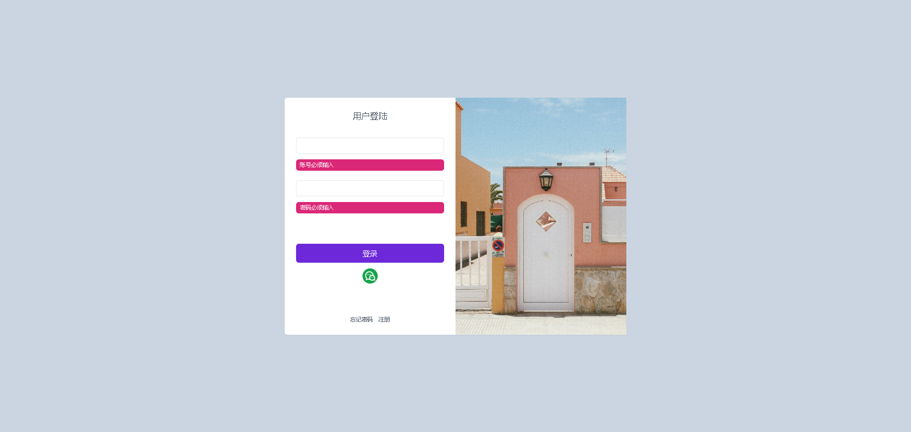

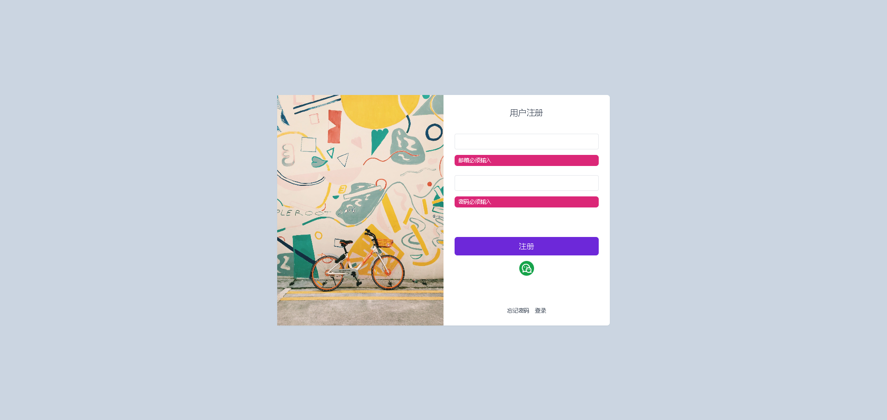

### 主界面

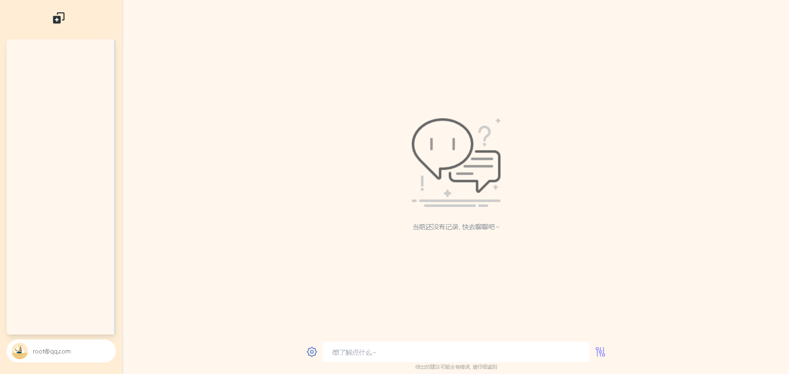

输入栏中进行提问，稍等片刻小助理就会回答你的问题啦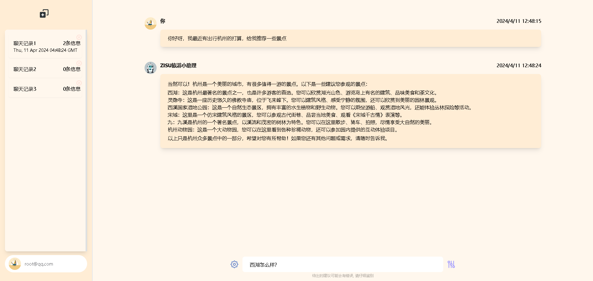

### 侧栏

点击“开启新对话”可创建隔离的session对话栏


下方可退出登录

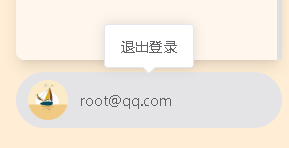

### 对话参数

输入框左侧的小齿轮为对话参数调整，对所有用户开放

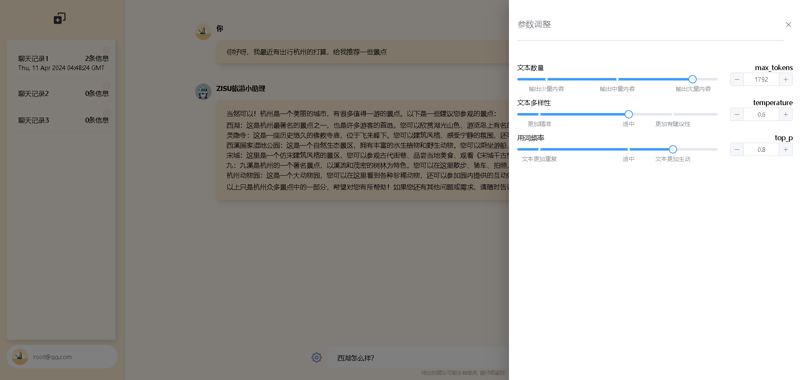

用户可配置以下参数，达到更佳的使用体验

- max_tokens，影响响应文本数量，数值越大返回的结果内容越多
- temperature，影响响应文本的灵活性，数值越大回答的范围会越广
- top_p，影响响应文本的生动性，数值越大回答的信息越生动

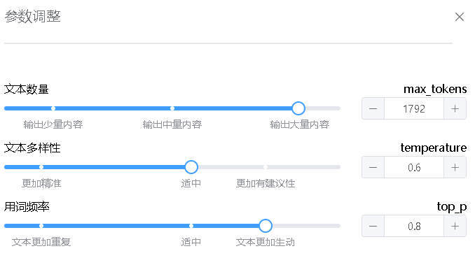

配置信息将自动缓存并提示用户

### 模型管理

输入框右侧的控制器图标为后台模型管理操作，仅对管理员开放

支持半自动和全自动两种模式，支持单轮对话与多轮对话

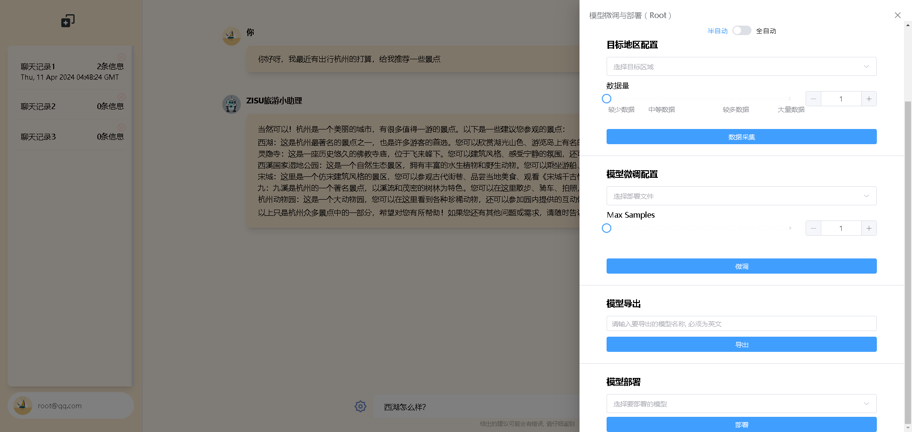

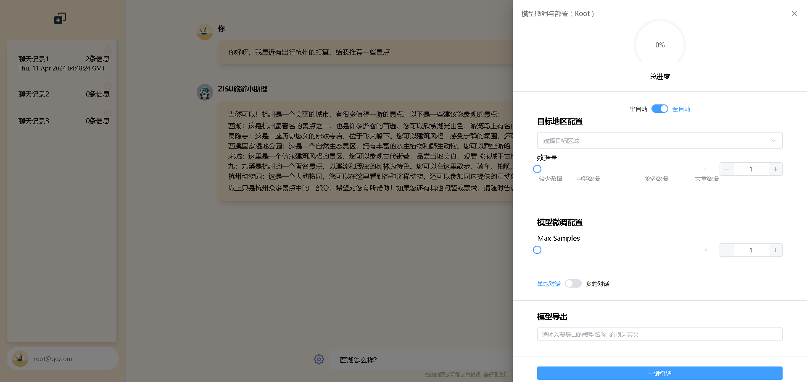

以半自动为例

下拉框支持国内省市二级数据下钻

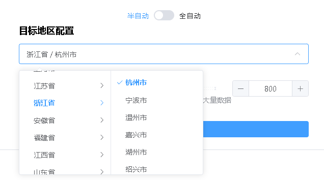

配置数据量，即采集的数据总条数，后续用于模型微调

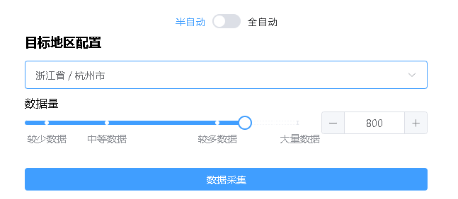

点击数据采集后，后台自动开始数据采集

---

模型微调配置：

下拉框选择要微调的数据，并设置Max Samples即可开始微调

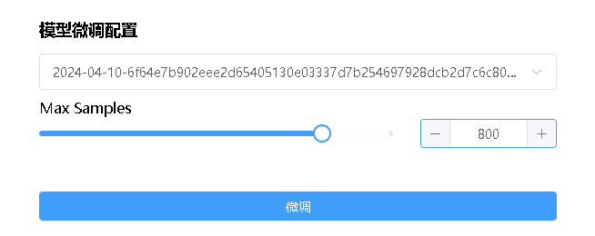

---

模型导出：

输入框中输出要导出的模型名称，点击后即可自动导出

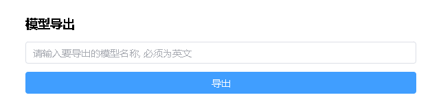

---

模型部署：

下拉框中可选择导出的模型，点击部署按钮后即可调度服务器重新部署模型

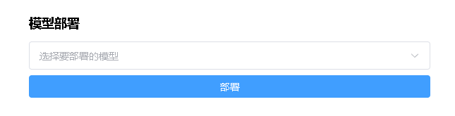

---

全自动模式同理，设置好相应配置后点击按钮即可一键完成“采集-微调-导出-部署”的流程

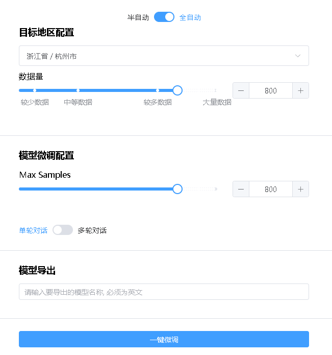

